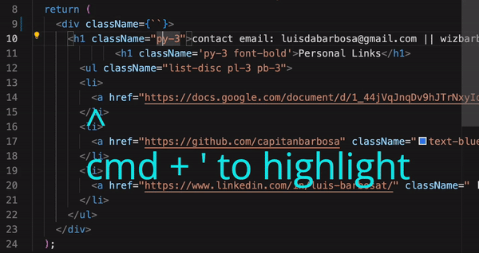

# vscode-quotation-highlighter README

Highlight all text within single or double quotations inside the vscode text editor.

## Usage
Press cmd + ' to quickly highlight all text inside single or double quotations.

